<h1>Opening the Project in Unity 🎮</h1>

<h3>1. Once you open github repository link you'll see something like the image below. Click on the green <b style="color: green;">Code</b> button to expand it and <b style="color: yellow;">Download ZIP</b> file.</h3>

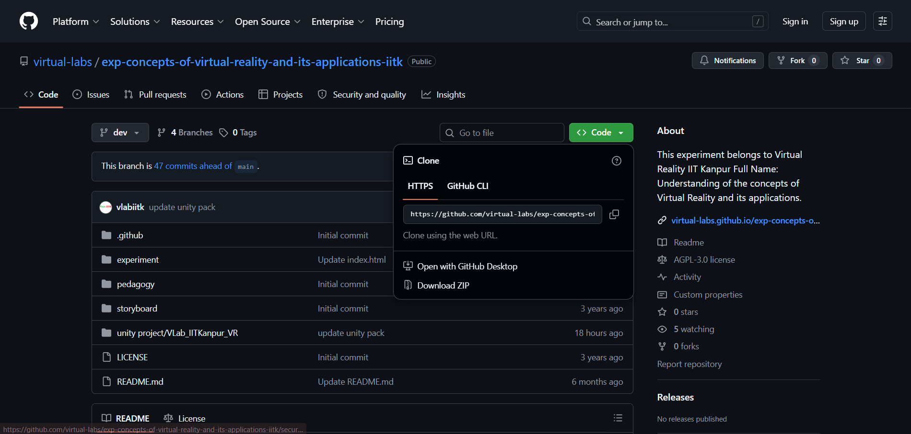

---------------------------------------------------------------------------------------------------------------------------------------------------

<h3>2. Once the ZIP is downloaded locate it in <b style="color: green;">Downloads</b></h3>

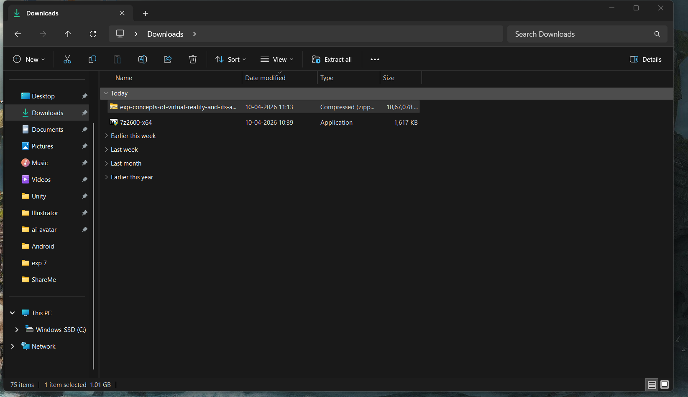

---------------------------------------------------------------------------------------------------------------------------------------------------

<h3>3. Create a folder named Unity or UnityVR at the root of your drive (C:\). Now move the downloaded zip into that folder. you'll see something like image below</h3>

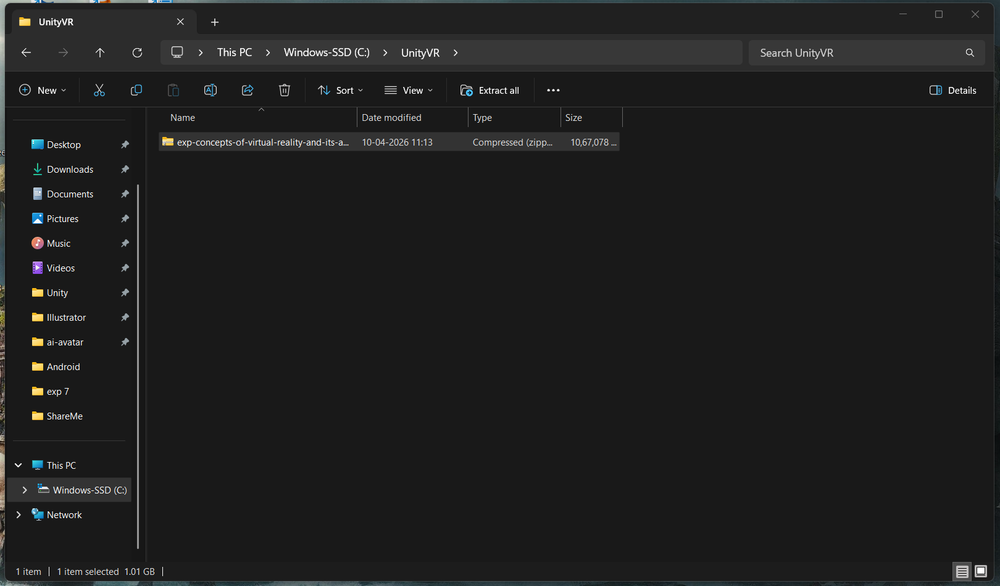

---------------------------------------------------------------------------------------------------------------------------------------------------

<h3>4. Now Extract the zip. if you get path too long error for any file in the zip use some newer third party tool like (b1 free archiver or 7 zip)</h3>

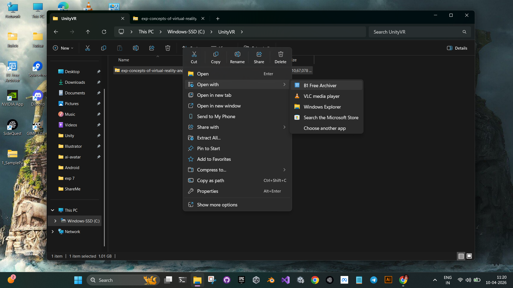

---------------------------------------------------------------------------------------------------------------------------------------------------

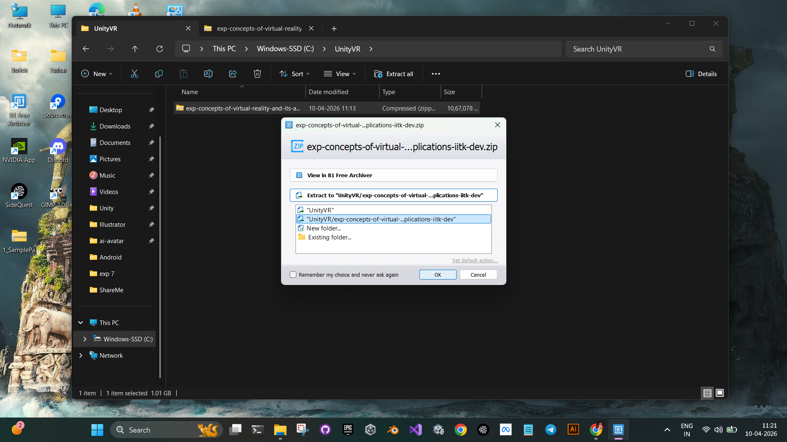

---------------------------------------------------------------------------------------------------------------------------------------------------

<h3>5. Now you'll see the extracted folder, open it and find unity project folder</h3>

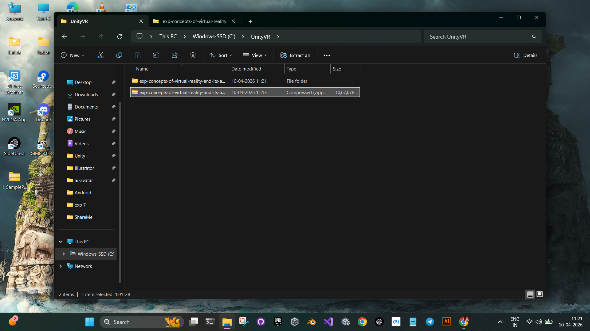

---------------------------------------------------------------------------------------------------------------------------------------------------

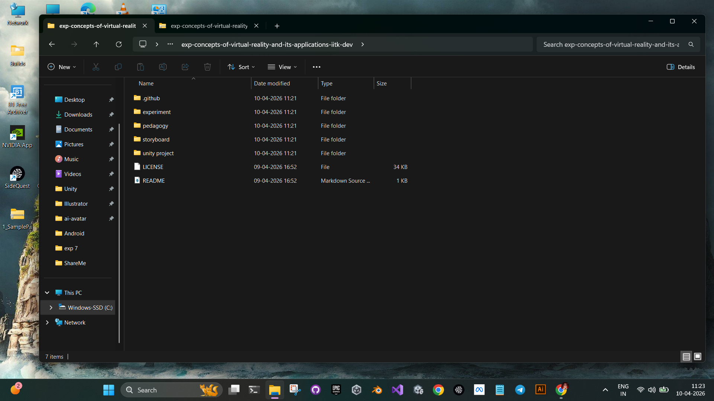

---------------------------------------------------------------------------------------------------------------------------------------------------

<h3>6. Inside <b style="color: orange;">unity project</b> folder you'll find the actual unity project which is opened in <b style="color: grey;">Unity Engine</b></h3>

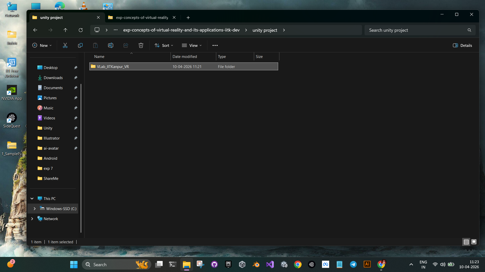

---------------------------------------------------------------------------------------------------------------------------------------------------

<h3>7. Move this folder to Unity or UnityVR folder that you created previously. this will prevent path too long errors.</h3>

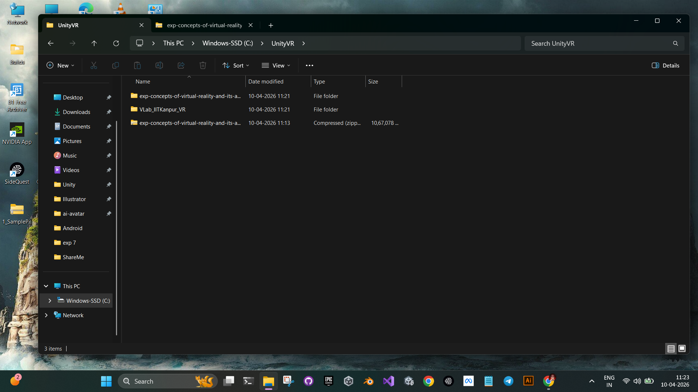

---------------------------------------------------------------------------------------------------------------------------------------------------

<h3>8. Now open Unity Hub and switch to projects tab if not already. You'll find Add button on the top right corner. click on it to expand and select <b style="color: orange;">Add project from disk</b></h3>

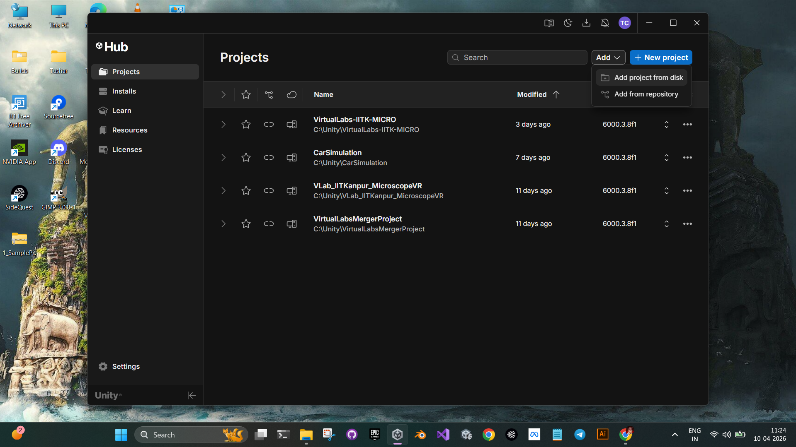

---------------------------------------------------------------------------------------------------------------------------------------------------

<h3>9. Select the project folder you moved previously to Unity or UnityVR and click Open</h3>

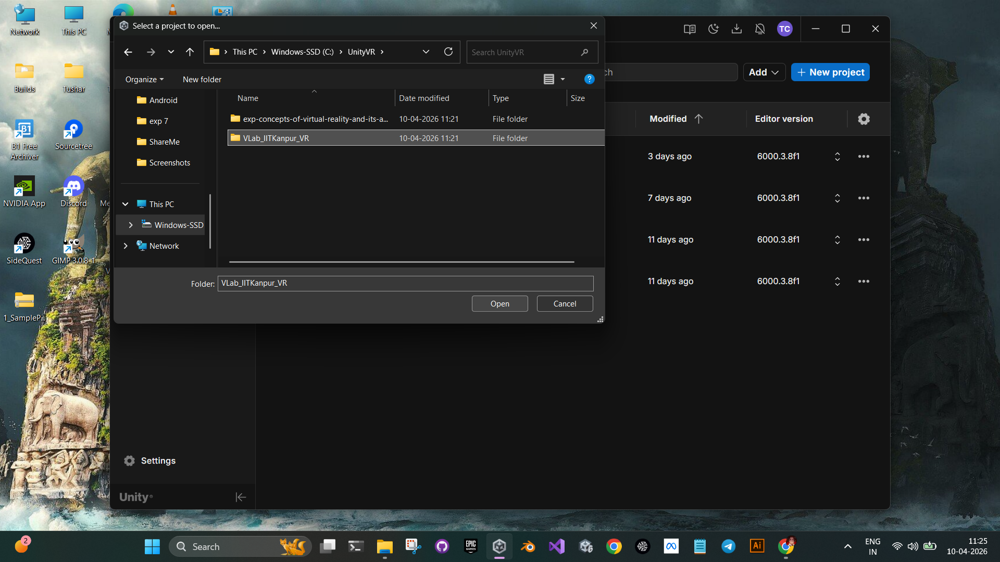

---------------------------------------------------------------------------------------------------------------------------------------------------

<h3>10. The project will be added to the projects list on unity hub. You'll see editor version in front of the project name. click on it to expand.</h3>

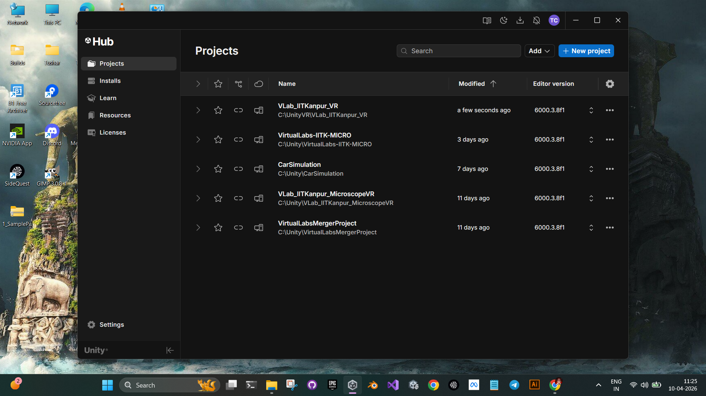

---------------------------------------------------------------------------------------------------------------------------------------------------

<h3>11. Now You'll see a list of installed editors make sure you choose <b style="color: blue;">6000.3.8f1</b> and switch the current platform to <b style="color: green;">Android</b>. after switching to Android click on Open with 6000.3.8f1</h3>

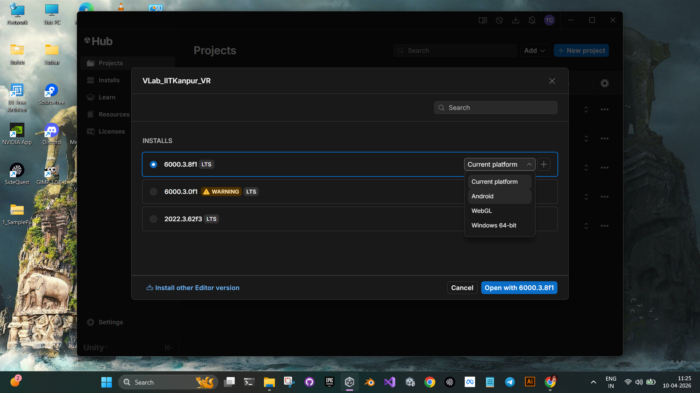

---------------------------------------------------------------------------------------------------------------------------------------------------

<h3>12. Unity will import all the assets and reslove dependencies it may take some time depending upon your system's performance</h3>

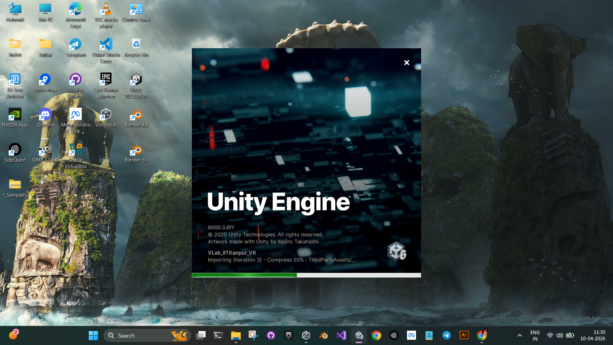

---------------------------------------------------------------------------------------------------------------------------------------------------

<h3>13. Once Unity is opened you'll see the editor window like the image below. So That's how you can work on the vr project associated with the repository</h3>

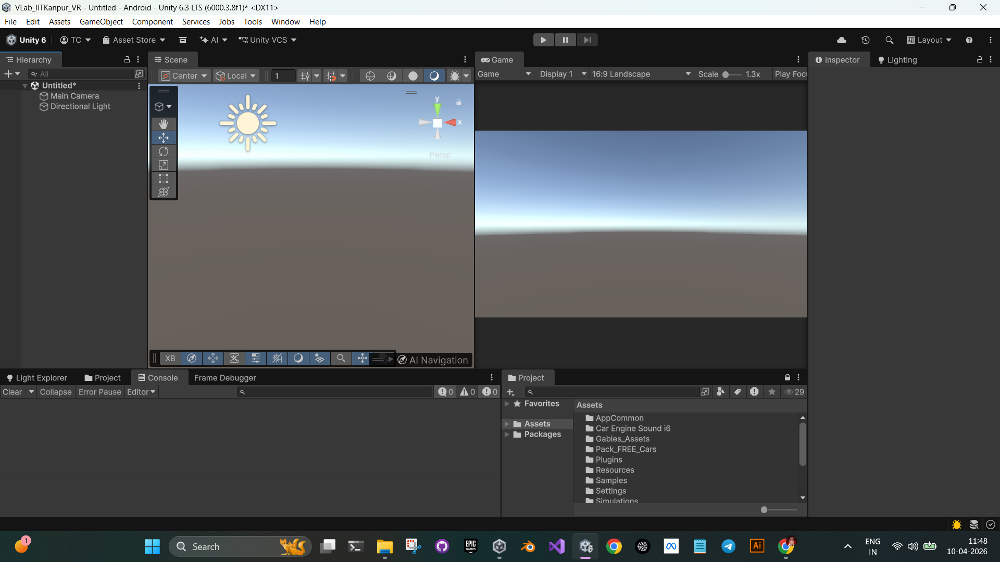

---------------------------------------------------------------------------------------------------------------------------------------------------

